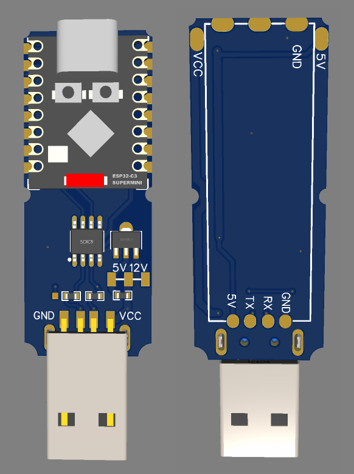
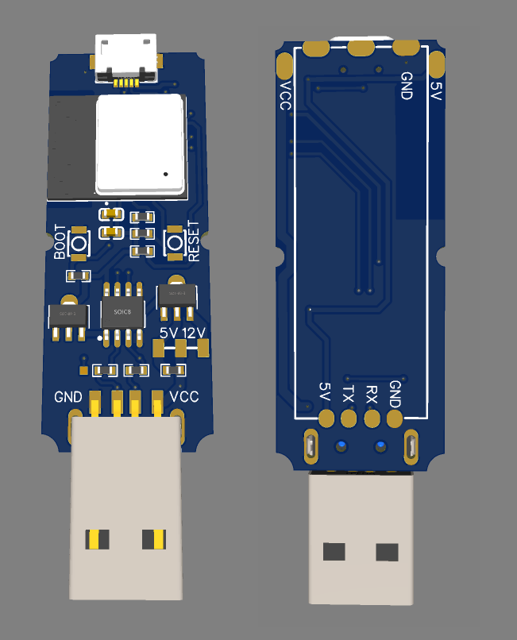

# ESP32_project

Адаптер для кондеционеров и конвекторов.

Ballu_convector.yaml - конфигурация ESPHome для Ballu конвекторы

### Полезные ссылки:

## Кондеционеры с портом UART

<a href=https://esphome.io/components/climate/midea.html>Протокол Midea в ESPHome</a> (кондеционеры Ballu, Electrolux, Qlima, Artel, Carrier, Comfee, Inventor, Senville)

<a href=https://esphome.io/components/climate/haier>Кондеционеры Haier ESPHome</a>

<a href=https://github.com/paveldn/haier-esphome>Кондеционеры Haier ESPHome</a>

<a href=https://github.com/bekmansurov/esphome_gree_hvac>Кондеционеры GREE ESPHome</a> (для HA есть так же стандартная интеграция позволяющая локально использовать кондеционеры GREE) <a href=https://t.me/gree_ac> Группа в Телеграмм</a>

<a href=https://github.com/GrKoR/esphome_aux_ac_component>Кондеционеры AUX ESPHome</a> - <a href=https://github.com/GrKoR/esphome_aux_ac_component/blob/master/docs/AC_TESTED.md> список кондеционеров</a> <a href=https://t.me/aux_ac> Группа в Телеграмм</a>

<a href=https://esphome.io/components/climate/tuya>Tuya Climate ESPHome</a>

<a href=https://github.com/Anat0l/hisense_acu2d>Hisense ESPHome</a>

<a href=https://github.com/JanM321/esphome-lg-controller>LG по шине LIN</a>

<a href=https://github.com/lNikazzzl/tcl_ac_esphome>Кондеционеры TCL</a>

<a href=https://github.com/joshbenner/esphome-daikin-s21>Кондеционеры Daikin</a>

<a href=https://github.com/Omniflux/esphome-fujitsu-halcyon>Fujitsu AirStage-H</a> - <a href=https://github.com/FOSV/Fuji-Atom-Interface>Плата преобразователь USRT-LIN</a> - <a href=https://community.home-assistant.io/t/fujitsu-ac-heat-pump-integration-via-esphome-esp32/407610>Форум ХА</a>

## Кондеционеры с портом rs485

<a href=https://github.com/omerfaruk-aran/esphome_samsung_hvac_bus>Samsung</a>

<a href=https://github.com/Mosibi/Midea-heat-pump-ESPHome>Тепловые насосы Midea, Airwell , Artel , Ferroli , Kaisai , Inventor , Kaysun , YORK </a>

<a href=https://github.com/Bunicutz/ESP32_Midea_RS485>Midea</a> (<a href=https://codeberg.org/xye/xye>описание протокола</a>)

<a href=https://github.com/raomin/ESPAltherma>Altherma</a>

## Тепловые насосы и кондеционеры HBS Home bus

<a href=https://github.com/Arnold-n/P1P2MQTT>Daikin Rotex Altherna</a>

<a href=https://github.com/Jetblack31/P1P2Serial>Daikin</a>

<a href=https://gregdavill.com/posts/daikin-esp-001/>Daikin ESPHome</a>

## Электросчетчики RS485

<a href=https://github.com/RocketFox2409/MercuryESPHome>Меркурий 200.02</a>

<a href=https://github.com/Brokly/ESPHome-Mercury230>Меркурий 230</a>

<a href=https://github.com/mrkrasser/MercuryStats>Протокол обмена Меркурий</a>

<a href=https://github.com/latonita/esphome-energomera-iec>Энергомера CE102M CE207 CE208 CE301 CE303 CE307 CE308 по RS-485 (ГОСТ МЭК/IEC 61107-2011)</a>

<a href=https://github.com/latonita/esphome-dlms-cosem>Подключение EspHome к счетчикам электроэнергии по протоколу DLMS/COSEM/СПОДЭС (Энергомера CE207/CE307/CE308, Милур 107S, Мир, Нартис, РиМ, Пульсар и многие другие)</a>
